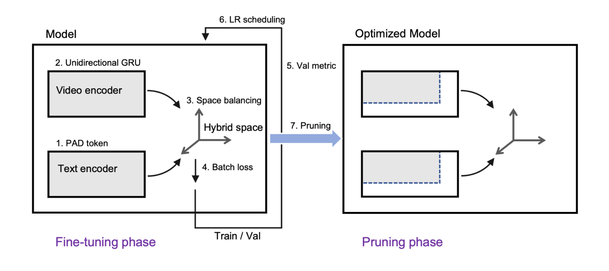
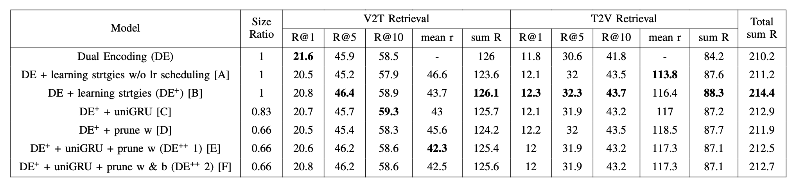

# dual-encoding-system
Code for ICCE-Asia 2023 paper [Dual Encoding++: Optimization of Text-Video Retrieval via Fine-tuning and Pruning](https://ieeexplore.ieee.org/document/10326384).

- [dual-encoding-system](#dual-encoding-system)
	- [Environment](#environment)
	- [Data](#data)
	- [Installation](#installation)
	- [Run](#run)
		- [Preparation](#preparation)
		- [Train](#train)
	- [Proposed Framework](#proposed-framework)
	- [Results](#results)


## Environment
- Ubuntu: 20.04 LTS
- Python: 3.8
- PyTorch: 2.0
- CUDA: 11.7.1
- cuDNN: 8.6.0

## Data
**MSR-VTT official split**
- Train: 6,513 clips, 130,260 captions
- Validation: 497 clips, 9,940 captions
- Evaluation: 2,990 clips, 59,800 captions

## Installation
We used Miniconda to set up our deep learning workspace. After installing Miniconda, you can create conda environment using `conda_env_cuda.yaml`.
```
conda env create --file conda_env_cuda.yaml
```

Please run the follwing command to download pre-trained video features (4.24 GB) and place
We used the same MSR-VTT video features used in original [Dual Encoding](https://arxiv.org/abs/2009.05381). They are the concatenation of ResNeXt-101 and ResNet-152 features. Please download msrvtt10k.tar.gz (4.24 GB) from this [Google Drive URL](https://drive.google.com/drive/folders/1BbtnZxbNnrT49DVMzDJan9DiQ7qeYrmA?usp=drive_link). After downloading it, extract the directory with the following command and place it under `data/`. For more information, you can refer refer [here](https://github.com/danieljf24/hybrid_space).
```
tar -xzvf msrvtt10k.tar.gz
```


We also used **pretrained word2vec** embeddings trained on 30M Flickr images' English tags provided by this [paper](https://arxiv.org/pdf/1709.01362.pdf). Please download word2vec.tar.gz (3 GB) from this [Google Drive URL](https://drive.google.com/drive/folders/1BbtnZxbNnrT49DVMzDJan9DiQ7qeYrmA?usp=drive_link) (same URL as the above). After downloading it, extract the directory with the following command and place it under `data/`. For more information, you can refer [here](https://github.com/danieljf24/w2vv).
```
tar -xzvf word2vec.tar.gz
```

After all, `data/` structure should be as follows.
```
data
├── msrvtt10k
│   ├── FeatureData
│   │   └── resnext101-resnet152
│   │       ├── feature.bin
│   │       ├── id.txt
│   │       ├── shape.txt
│   │       └── video2frames.txt
│   └── TextData
│       ├── msrvtt10ktest.caption.txt
│       ├── msrvtt10ktrain.caption.txt
│       └── msrvtt10kval.caption.txt
└── word2vec
    ├── feature.bin
    ├── id.txt
    └── shape.txt
```


## Run
### Preparation
1. To craete vocabulary from training dataset's captions, please run `bash run.sh vocab`. This creates `vocab.json`.
2. To create tags (concept features), please run `bash run.sh tags`. This creates `tag_vocab.json` and `video_tag.txt`.
3. To create word2vec embeddings, please run `bash run.sh word2vec`. This creates `pretrained_weight.npy` used for trianing.

### Train
- To train the model, please run `bash run.sh train_hybrid_cuda`. (Training automatically includes evaluation at the end.)
- To evaluate the model, please run `bash run.sh test_hybrid_cuda $MODEL_PATH`.
- For debug mode, please run `bash run.sh train_hybrid_cpu_debug` after creating captions for debug using `bash run.sh tiny`.

You can check out commands in `run.sh`.

## Proposed Framework


## Results

- Larger R@Ks and sum R, and smaller mean r represent better performance.
- [B] shows considerable performance improvement compared to Dual Encoding.
- Final optimized models [E] and [F] have smaller sizes and better overall performance than Dual Encoding.